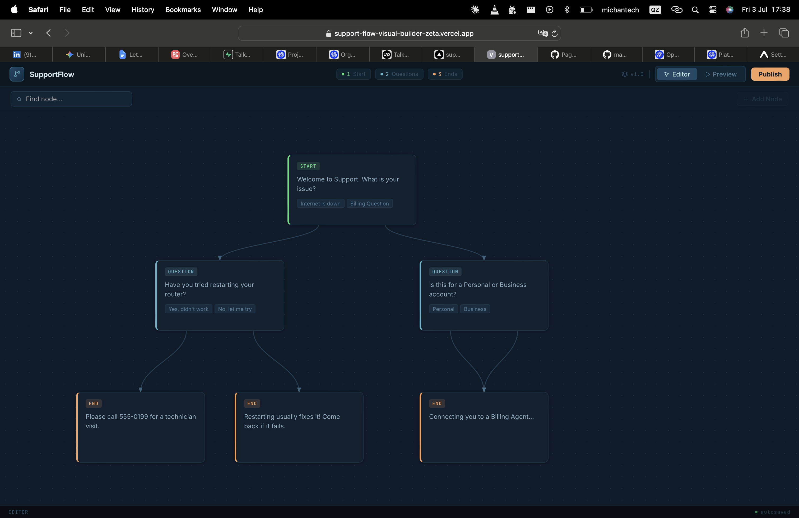
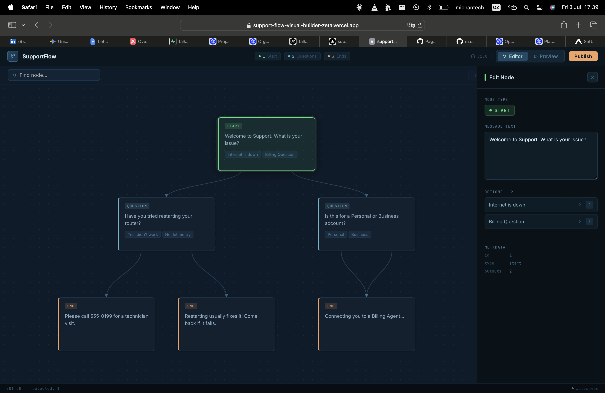
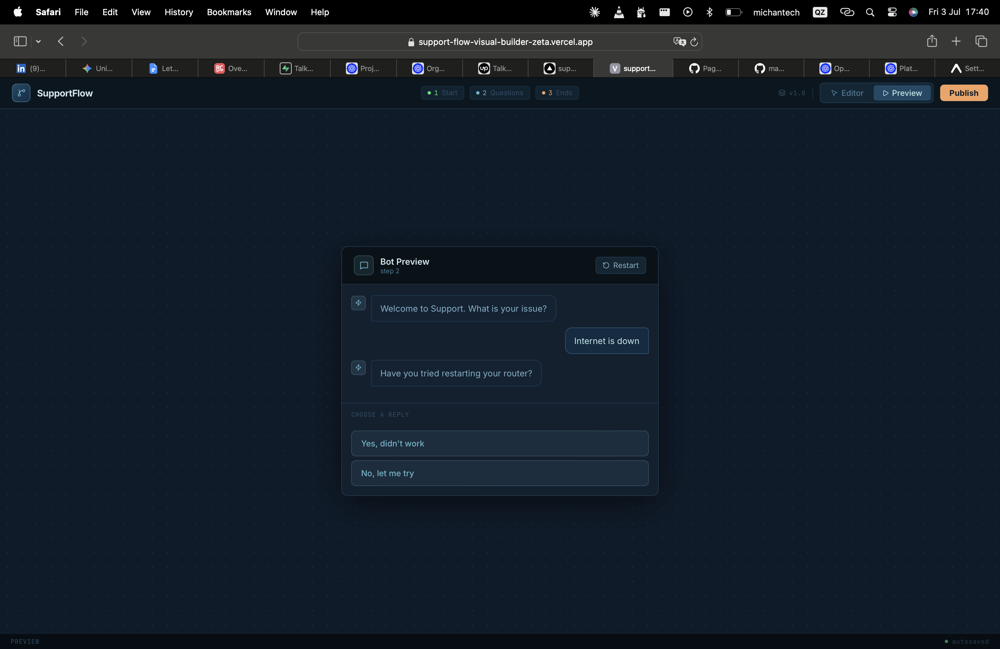
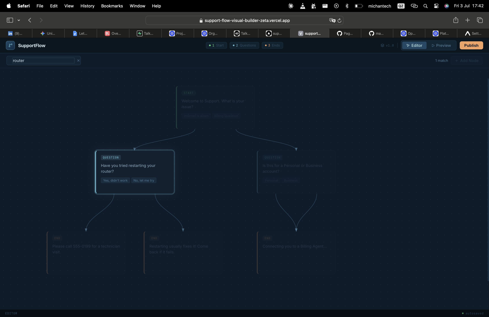

# SupportFlow — Visual Decision Tree Builder

A visual editor for building customer support chatbot conversation flows. Instead of managing chatbot logic in a spreadsheet, this lets a non-technical product manager see the whole conversation as a flowchart, edit questions in real time, and test-drive the bot before it goes live.

## Live Demo

[support-flow-visual-builder-zeta.vercel.app](https://support-flow-visual-builder-zeta.vercel.app/)

## The Problem

SupportFlow AI (the client for this challenge) currently configures their chatbot logic through an Excel spreadsheet. It works, but it's error-prone, nobody outside engineering can actually visualize the flow, and updating a single question means digging through rows that don't map cleanly to how a conversation actually branches. This tool replaces that spreadsheet with a canvas; nodes represent each step in the conversation, arrows show where each answer leads, and you can click into any node to edit it directly.

## Tech Stack

- React 19 + TypeScript
- Vite
- Custom SVG rendering for all connector lines (no react-flow, no jsPlumb; built from scratch)
- lucide-react for icons

## Getting Started

```bash
npm install
npm run dev
```

Open `http://localhost:5173` in your browser.

## Features

- **Canvas view** — renders the full conversation flow from `flow_data.json`, with nodes positioned exactly where the data specifies and colour-coded by type (start / question / end)
- **Connectors** — SVG lines drawn between parent and child nodes based on each option's `nextId`, with arrowheads showing direction
- **Inline editing** — click any node to open an edit panel and update its message text live
- **Preview mode** — simulates the actual bot conversation. Pick an option, move to the next node, see the full conversation trail build up as you go
- **Node search** *(wildcard feature)* — type a keyword and matching nodes glow while everything else dims, so you can find a specific node instantly in a large flow

## Screenshots

**Canvas view**


**Edit panel**


**Preview mode**


**Search & Highlight**


## Architecture Decisions

**Absolute positioning from JSON coordinates.** Each node in `flow_data.json` has an `x`/`y` position, so I render every `FlowNode` with `position: absolute` using those exact values. No layout engine calculating positions for me; the data is the source of truth for where things sit on screen.

**Hand-built SVG connectors.** The brief specifically ruled out flow libraries like react-flow, so the connector lines are plain SVG `<line>` elements drawn between each node's bottom-center and its target's top-center. I use a `Map` to look up target nodes by `id` instead of `.find()` inside the render loop — with more nodes that difference goes from O(n) to O(1) per lookup, which matters once a flow has more than a handful of nodes.

**Single source of truth for state.** `useFlowState` holds the node list, the currently selected node, and the preview traversal state. `selectedNode` is derived from `selectedNodeId` + the node list rather than stored separately as its own piece of state; this avoids the two ever going out of sync, which is a classic bug when you store a full object in state instead of just its id.

**Immutable updates.** Editing a node's text uses `.map()` to return a new array with the updated node, rather than mutating the existing object. Small thing, but it's the difference between predictable re-renders and subtle bugs where React doesn't notice a change.

## Wildcard Feature: Node Search & Highlight

Type a keyword into the search bar and any node whose text matches gets a highlighted glow, while non-matching nodes dim to -30% opacity.

**Why this feature:** Real support flows aren't 6 nodes — they're 50, 100+. A non-technical PM trying to find "the node about refund policy" inside a sprawling flowchart shouldn't have to scan every card by eye. This turns that into a two-second lookup, which is the exact kind of friction the original spreadsheet had that this tool is meant to remove.

## Design

Figma file: https://www.figma.com/make/EkI2LgmmKhgjNQiJ6s9I7W/Dark-mode-UI-for-SupportFlow?t=PkdulnAA8TsNbYyh-1

The design frames cover the canvas view, the edit panel, and the preview/chat mode; the same three states the built app moves between.

## What I'd Build Next

- Drag-to-reposition nodes on the canvas instead of fixed JSON coordinates
- Ability to add and delete nodes, with automatic connector cleanup
- Undo/redo for edits
- Persisting edits to local storage or a backend instead of resetting on refresh